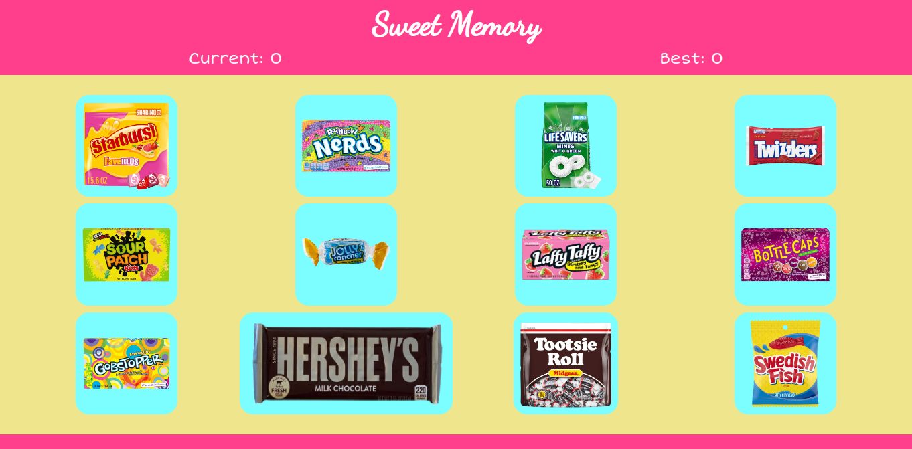

# Sweet Memory

Sweet Memory is a small candy-themed memory game created with create-react-app.
The game is played by trying to click on as many unique candies in a row. If you click a candy you've clicked before, your score is reset to zero and you get to try again.

[Live Demo](https://joel-singh.github.io/sweet-memory/)

